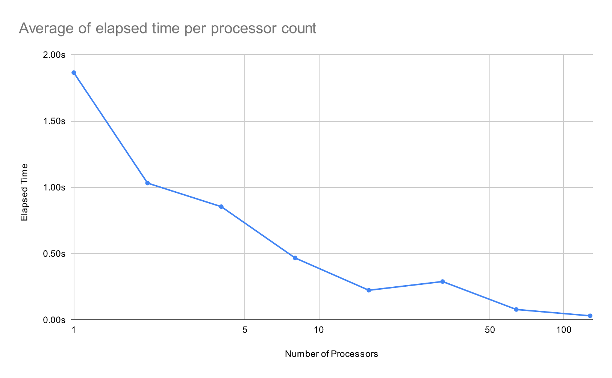

## Első javítás (soros algoritmus)

A `solution.cpp` belső ciklusa addig futott, amíg el nem érte a `maxIterations` értéket, még akkor is, ha a pont már korábban „kilépett” (a küszöb után a pixelt fehérre állítottuk). Ilyenkor a maradék iterációk felesleges lépések voltak.

**Mért javulás (10-10 futtatásból):** előtte kb. **3,54–3,65 s**, utána kb. **0,83–0,84 s** — nagyságrendileg **~4,3×** gyorsulás.

## Párhuzamosítás

A mandelbrot-kép pixeleit a `solution.cpp` két beágyazott ciklussal számolja ki. A párhuzamosítást **OpenMP**-vel végeztem: a külső és belső ciklusra `#pragma omp parallel for collapse(2)` került, így a 1024×1024 iterációs tér egyetlen párhuzamos régióban, szálak között oszlik meg.

Az alábbi ábra a **processzorok száma szerinti átlagos futási időt** mutatja (több futtatás átlaga, 1, 2, 4, …, 128 szál/processzor konfigurációk).

**Gyorsulás:** 1-ről 16 processzorra a futási idő kb. **1,85 s → 0,23 s**, azaz nagyjából **8×** gyorsulás. 1-ről 128-ra kb. **1,85 s → 0,03 s**, tehát összesen nagyságrendileg **~60×** gyorsulás. A 16 → 32 átmenetnél az átlagidő kissé megnő; ez tipikusan szinkronizációs és ütemezési költségekkel, illetve a klaszter adott terhelésével magyarázható, nem feltétlenül jelenti, hogy a kód 32 szálon rosszabb lenne minden körülmény között.

