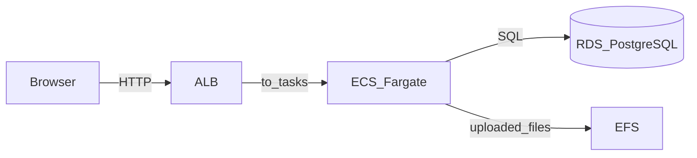
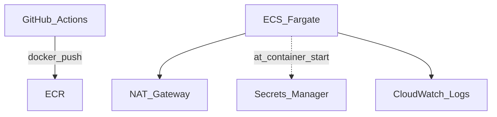

## Terraform (AWS ECS/Fargate)

This folder provisions the infrastructure to run this app on **AWS ECS/Fargate** behind an **ALB**, with **PostgreSQL on RDS**, persistent uploads on **EFS**, and secrets in **Secrets Manager**.

### Architecture

Everything below lives in **one VPC** (public subnets for the load balancer and NAT; private subnets for Fargate, RDS, and EFS mount targets).

**1. Request path — what users hit on each page load**



**2. Deploy and platform traffic — not part of every browser request**

| Concern | What happens |
| --- | --- |
| New container versions | CI pushes an image to **ECR**; ECS starts replacement tasks that **pull** that image. |
| Outbound from private tasks | Tasks have **no public IP**, so pulls and other outbound calls go **NAT Gateway → internet / AWS APIs**. |
| Startup configuration | At container start, the **task execution role** reads **Secrets Manager** and injects `RDS_PASSWORD` and `SECRET_KEY`. |
| Observability | App logs go to **CloudWatch Logs**. |



The diagram above leaves ECR off the NAT branch on purpose: the important idea is **private tasks use NAT for outbound access** (including talking to ECR and other AWS services unless you add **VPC endpoints** later).

### Prereqs

- AWS credentials configured (profile or env vars)
- Terraform installed

Defaults:
- **Region**: `eu-north-1`
- **HTTP only** (ALB DNS). HTTPS/custom domain can be added later (ACM + Route53).

---

## Remote state bootstrap (one-time)

Terraform’s S3 backend can’t create its own backend bucket/table, so bootstrap it first.

1. Create backend resources:

```bash
cd infra/terraform/bootstrap
terraform init
terraform apply
```

2. Note the outputs:
- `state_bucket`
- `lock_table`

---

## Provision the stack

1. Configure backend.

Edit `infra/terraform/backend.tf` and set:
- bucket = the `state_bucket` output
- dynamodb_table = the `lock_table` output

2. Deploy:

```bash
cd infra/terraform
terraform init
terraform apply
```

3. After apply, open the app:
- Use the `alb_dns_name` output.

---

## Container deploy (image updates)

Terraform provisions an ECR repo. You can:
- build/push an image to ECR
- update the ECS service to the new image tag

An optional GitHub Actions workflow is provided in `.github/workflows/deploy-ecs.yml`.

Notes:
- The ECS task uses the `:latest` image tag by default; the workflow pushes both `:latest` and `:${{ github.sha }}` and then forces a new deployment.
- The app is configured via `RDS_*` environment variables, with `RDS_PASSWORD` and `SECRET_KEY` loaded from Secrets Manager.

