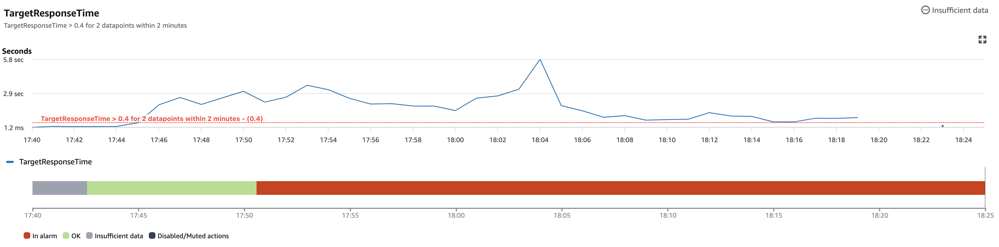
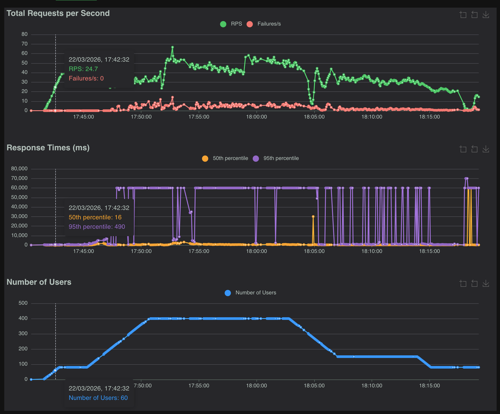
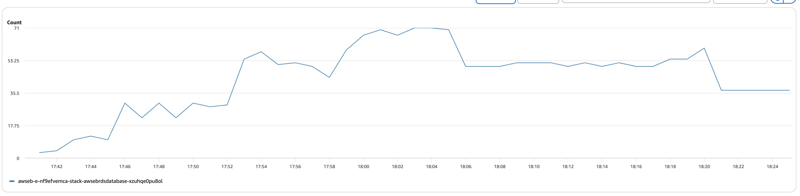

# Load Test

## Scaling Parameters

- Scaling cooldown: 360s _waiting period after a scaling activity (like adding or removing servers) during which no new scaling actions are triggered_
- Scaling metric: `TargetResponseTime` _time from when the load balancer forwards the request to a target until the target starts sending the response back_
- Breach duration: 2m _the amount of time a metric can exceed a threshold before triggering a scaling operation_
- Upper/Lower threshold: [150ms, 400ms]

If an alarm is hit for more then `BreachDuration` then a scaling activity is triggered, after that for `ScalingCooldown` amount of time no scaling activity can be triggered. 

## Timeline of the test 

|   Time    |                   Event                           |
|:---------:|:--------------------------------------------------|
| **17:40** |  Test started with **80 concurrent users**        |
| **17:45** |  Scaled up to **400 concurrent users**            |
| **17:50** | ️ **Alarm triggered**; **new node added**          |
| **17:57** |  Alarm triggered **again**; **new node added**    |
| **18:02** |  Scaled down to **150 concurrent users**          |
| **18:13** |  Further reduced to **80 concurrent users**       |
| **18:20** |  **Test shutdown**                                |

**The metric triggering scaling activities over the period of the test:**

---

**The locust chart from the load testing:**

---

**The number of connections to the database of the period of the test:** 

# Findings

Firstly the setup started out with a single `t3.micro` instance (2 vCPU, 1GB ram), and 80 concurrent users simulated by locust on a separate `t3.micro` instance on AWS. The rampup rate was 1 user/sec at around 17:43 we reached the maximum amount and it stayed like that till 17:45, until then the single instance could handle the load generated by the users, the 95th percentile response time was mostly under 500ms.

Then I increased the maximum number of concurrent users to 400, which started causing trouble at around 250 users when response time increased dramatically, this in turn caused an alarm to be triggered and hence another instance to be started at 17:50, we can see that the instance started joinning the work at around 17:52 hence the increase in the number of database connections.

At 17:57 another node was added to the party but it couldn't help much, response time was still very very high. And after that the load could not be handled even when reverting to 150 then 80 concurrent users.

## Problems

I downloaded the logs and started diagnosing the issues, this were the problems that I found:

- The following error was thrown for a lot of requests, resulting in the failure of those. The error gets thrown when a request handler needs a connection from the pool and waits for one, but the waiting times out. 
`sqlalchemy.exc.TimeoutError: QueuePool limit of size 5 overflow 10 reached, connection timed out, timeout 30.00 (Background on this error at: https://sqlalche.me/e/20/3o7r)`

- The meaning of this error is the following: PostgreSQL is refusing new connections because the instance hit its max_connections (with some slots reserved for superuser/maintenance).
`psycopg2.OperationalError: connection to server at "awseb-e-nf9efvemca-stack-awsebrdsdatabase-xzuhqe0pu8ol.cpka66ugowfi.eu-north-1.rds.amazonaws.com" (172.31.9.252), port 5432 failed: FATAL:  remaining connection slots are reserved for roles with privileges of the "rds_reserved" role`

- The most costly mistake was in a missconfiguration of the locustfile, the `delete_photo` task was decorated with `@task(1)` but `upload_photo` was decorated with `@task(2)` so the execution number of these tasks was not in balance, `upload_photo` was weighted 2 times what `delete_photo` was, resulting in **6296** photos. This in turn caused the most severe performance impact since the dashboard is the most frequently queried place returning all available images and it's not using pagination.

## Solutions

- **Centralize DB connections** — Use [RDS Proxy](https://aws.amazon.com/rds/proxy/) or PgBouncer so many app workers share a small pool of connections to PostgreSQL instead of each process opening up to `pool_size + max_overflow` connections.
- **Cap total connections** — Ensure `(instances × workers × (DB_POOL_SIZE + DB_MAX_OVERFLOW))` stays safely below RDS `max_connections` (minus reserved slots), or reduce workers/pool settings per instance when scaling out.
- **Scale or tune RDS** — Use a larger instance class or raise `max_connections` if the workload legitimately needs more concurrent DB sessions.
- **Fix the load scenario** — Match `upload_photo` and `delete_photo` (or other write) weights so Locust does not inflate dataset size unrealistically.

